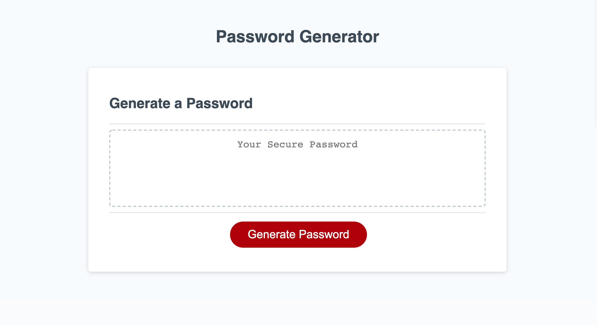
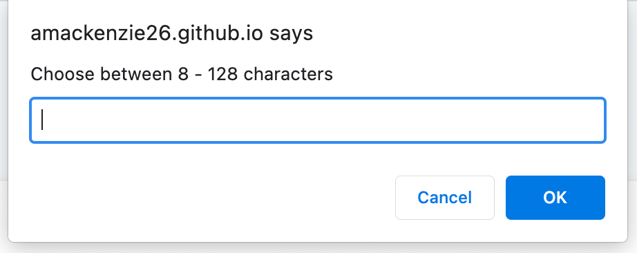
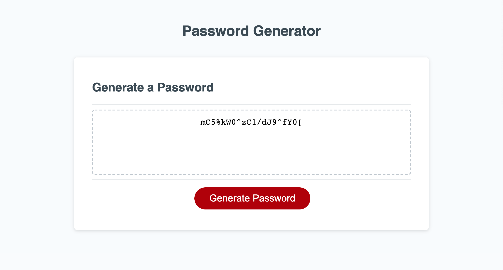

# Password Generator Project

## Description

For this project I was assigned to take existing HTML and CSS documents and write the code for a Javascript file that creates functionality for a password generator. My parameters were to allow the user to select between 8-128 characters, uppercase characters, lowecase characters, numbers, and symbols to be incorporated into the random password to be generated upon the clicking of a button.

## Installation

To install this project you simply need to be able to access a Google Chrome browser window and have a reliable internet connection. 

Open a browser window, copy and past this link () into the URL section, and view the webpage upon loading. 

Click the "Generate Password" button;

Complete all prompts.

View your random generate password!

## Usage

To generate your password, click the "Generate Password button:

You will then be given a series of prompts to complete:

Once completed, your random password will generate:

 
## Built With

HTML
CSS
Javascript

## Deployable Link

https://amackenzie26.github.io/password-generator-project/

## Authors

Alec Mackenzie

## Links

Github Repo: https://github.com/amackenzie26/password-generator-project
URL: https://amackenzie26.github.io/password-generator-project/

## License

    
## Credits

Thank you for assistance from BCB Staff,, W3schools.com, stackoverflow.com.

I utilized a youtube tutorial: https://www.youtube.com/watch?v=duNmhKgtcsI which incorportated algorithms created by https://codepen.io/FlorinPop17/pen/BaBePej within portions of my code that allowed for the functionality of this application. Thank you to the author Florin Pop and youtube channel Traversy Media.
